# Kerala Election Prediction Leaderboard

## Demo


## Pending changes
1. Add table for final election results, vote margins, and vote share percentages.
1. Calculate scores and display leaderboard.
1. Show previous election results and exit polls.
1. Validate predictions.
1. Use AI to assist with predictions.

## Collect the details for election
1. Collect data for Kerala General Election
    - [2024](https://en.wikipedia.org/wiki/2024_Indian_general_election_in_Kerala)
    - [2019](https://en.wikipedia.org/wiki/2019_Indian_general_election_in_Kerala#Constituency-wise_Result)
    - [2014](https://en.wikipedia.org/wiki/2014_Indian_general_election_in_Kerala#Results)
    - [2009](https://en.wikipedia.org/wiki/2009_Indian_general_election_in_Kerala#List_of_Elected_MPs)

    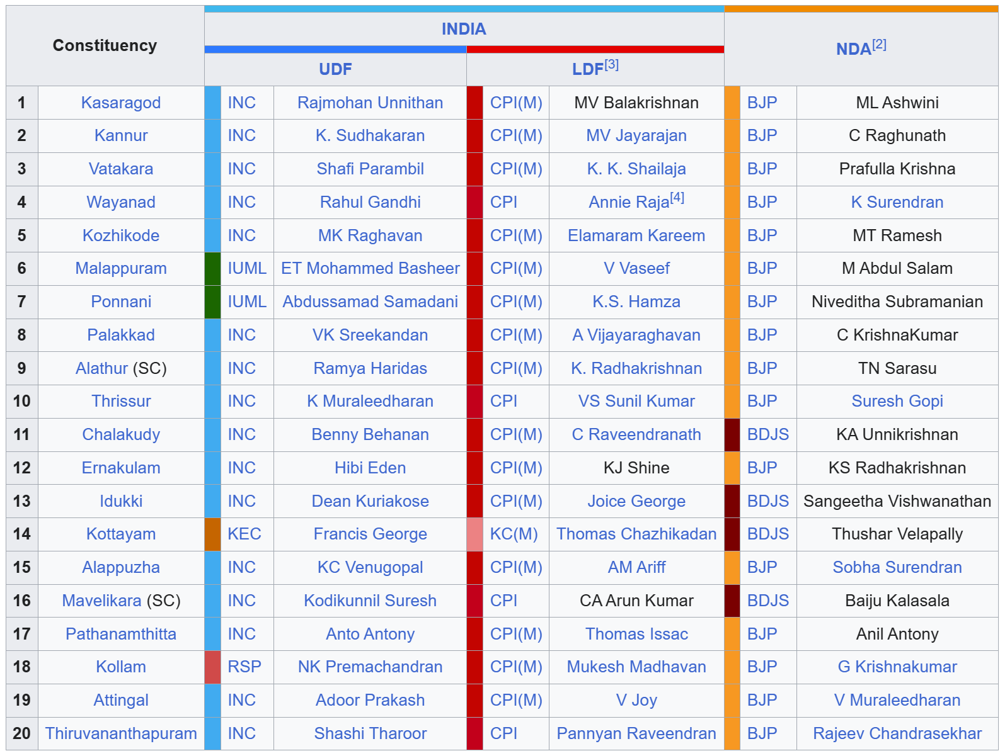

1. Collect data from [keralaassembly.org](http://keralaassembly.org/lok/index.html)

1. Download candidate photos from https://affidavit.eci.gov.in/

1. Get voter turnout percentages from https://elections24.eci.gov.in/eci-updates.html

## Set up Supabase
1. Go to [Dashboard](https://supabase.com/dashboard/projects) & create _New project_
    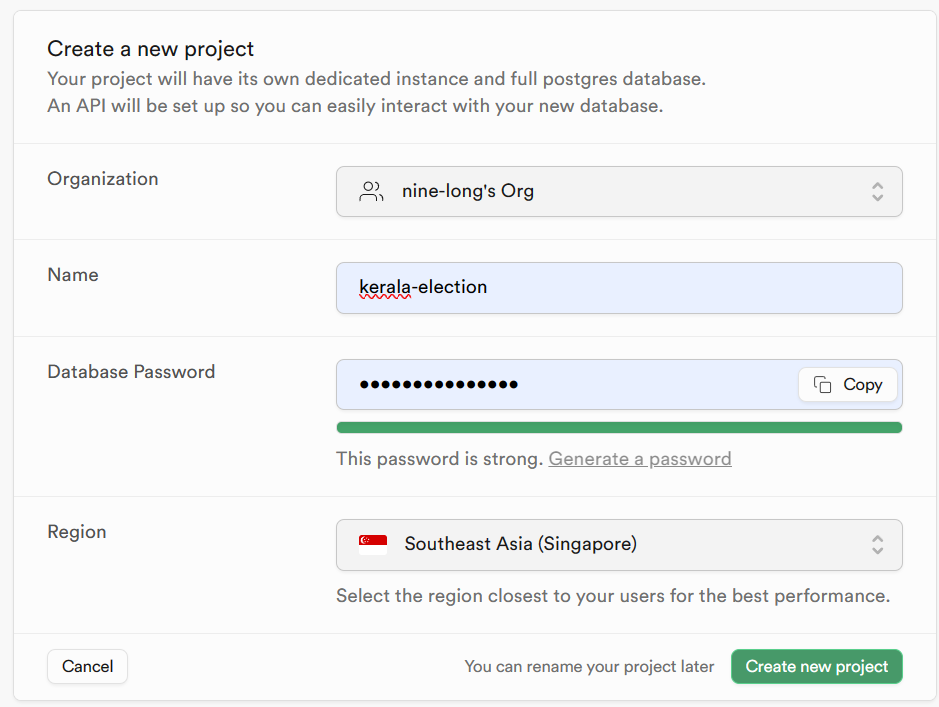
1. Use [SQL Editor page](https://supabase.com/dashboard/project/_/sql) to run _User Management Starter_ and set up the database:
    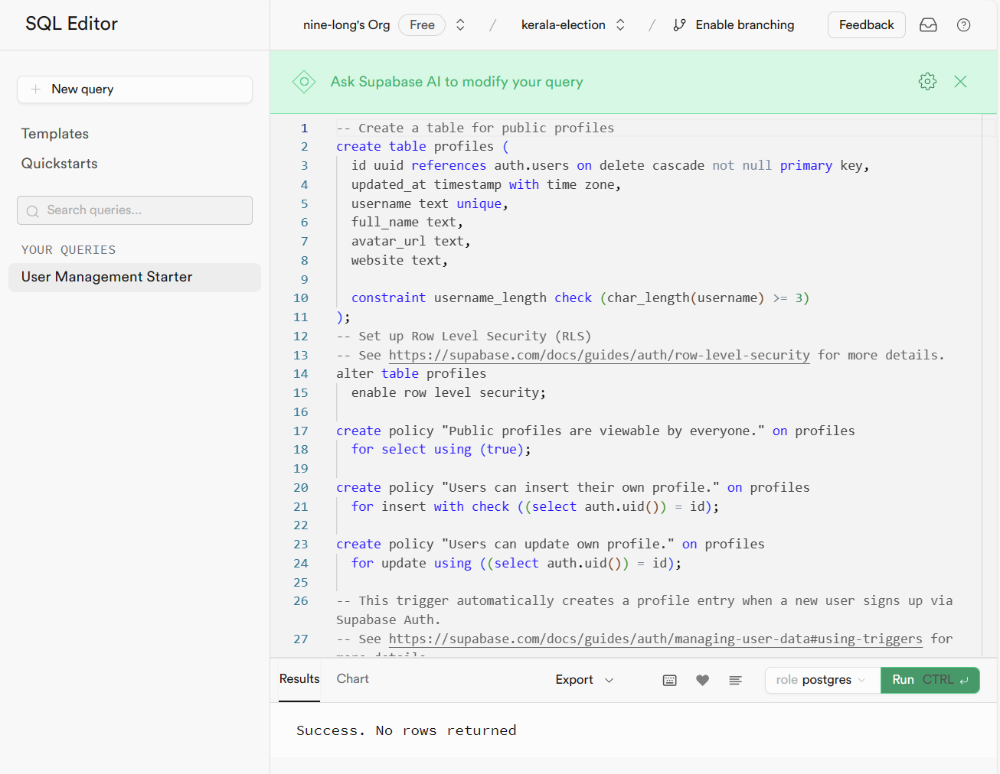
1. Find your Project _URL_, _anon_, and _service_role_ keys from [API Settings page](https://supabase.com/dashboard/project/_/settings/api) in the Dashboard.
1. Save _SUPABASE_URL_ and the _SUPABASE_KEY_ key in a .env file in your root directory of your SvelteKit project.
    ```json
    PUBLIC_SUPABASE_URL="YOUR_SUPABASE_URL"
    PUBLIC_SUPABASE_ANON_KEY="YOUR_SUPABASE_KEY"
    ```
1. Go to SQL Editor page, create a new query and run to create election candidate list:
    ```sql
    CREATE TABLE kerala_election_2024 (
        id SERIAL PRIMARY KEY,
        constituency VARCHAR(255),
        udf_candidate VARCHAR(255),
        ldf_candidate VARCHAR(255),
        nda_candidate VARCHAR(255),
        other1 VARCHAR(255)
    );

    INSERT INTO kerala_election_2024 (constituency, udf_candidate, ldf_candidate, nda_candidate) VALUES
    ('Kasaragod', 'Rajmohan Unnithan', 'MV Balakrishnan', 'ML Ashwini'),
    ('Kannur', 'K. Sudhakaran', 'MV Jayarajan', 'C Raghunath'),
    ('Vatakara', 'Shafi Parambil', 'K. K. Shailaja', 'Prafulla Krishna'),
    ('Wayanad', 'Rahul Gandhi', 'Annie Raja', 'K Surendran'),
    ('Kozhikode', 'MK Raghavan', 'Elamaram Kareem', 'MT Ramesh'),
    ('Malappuram', 'ET Mohammed Basheer', 'V Vaseef', 'M Abdul Salam'),
    ('Ponnani', 'Abdussamad Samadani', 'K.S. Hamza', 'Niveditha Subramanian'),
    ('Palakkad', 'VK Sreekandan', 'A Vijayaraghavan', 'C KrishnaKumar'),
    ('Alathur (SC)', 'Ramya Haridas', 'K. Radhakrishnan', 'TN Sarasu'),
    ('Thrissur', 'K Muraleedharan', 'VS Sunil Kumar', 'Suresh Gopi'),
    ('Chalakudy', 'Benny Behanan', 'C Raveendranath', 'KA Unnikrishnan'),
    ('Ernakulam', 'Hibi Eden', 'KJ Shine', 'KS Radhakrishnan'),
    ('Idukki', 'Dean Kuriakose', 'Joice George', 'Sangeetha Vishwanathan'),
    ('Kottayam', 'Francis George', 'Thomas Chazhikadan', 'Thushar Vellapally'),
    ('Alappuzha', 'KC Venugopal', 'AM Ariff', 'Sobha Surendran'),
    ('Mavelikara (SC)', 'Kodikunnil Suresh', 'CA Arun Kumar', 'Baiju Kalasala'),
    ('Pathanamthitta', 'Anto Antony', 'Thomas Isaac', 'Anil Antony'),
    ('Kollam', 'NK Premachandran', 'Mukesh Madhavan', 'G Krishnakumar'),
    ('Attingal', 'Adoor Prakash', 'V Joy', 'V Muraleedharan'),
    ('Thiruvananthapuram', 'Shashi Tharoor', 'Pannyan Raveendran', 'Rajeev Chandrasekhar');
    ```

1. Go to SQL Editor page, create a new query and run to create  candidate to party mapping:

    ```sql
    CREATE TABLE candidate_party_mapping (
        id SERIAL PRIMARY KEY,
        constituency_number INTEGER,
        constituency_name VARCHAR(255),
        candidate_name VARCHAR(255),
        party VARCHAR(255),
        photos_url TEXT
    );

    INSERT INTO candidate_party_mapping (constituency_number, constituency_name, candidate_name, party) VALUES
    (1, 'Kasaragod', 'Rajmohan Unnithan', 'INC'),
    (1, 'Kasaragod', 'MV Balakrishnan', 'CPI(M)'),
    (1, 'Kasaragod', 'ML Ashwini', 'BJP'),
    (2, 'Kannur', 'K. Sudhakaran', 'INC'),
    (2, 'Kannur', 'MV Jayarajan', 'CPI(M)'),
    (2, 'Kannur', 'C Raghunath', 'BJP'),
    (3, 'Vatakara', 'Shafi Parambil', 'INC'),
    (3, 'Vatakara', 'K. K. Shailaja', 'CPI(M)'),
    (3, 'Vatakara', 'Prafulla Krishna', 'BJP'),
    (4, 'Wayanad', 'Rahul Gandhi', 'INC'),
    (4, 'Wayanad', 'Annie Raja', 'CPI'),
    (4, 'Wayanad', 'K Surendran', 'BJP'),
    (5, 'Kozhikode', 'MK Raghavan', 'INC'),
    (5, 'Kozhikode', 'Elamaram Kareem', 'CPI(M)'),
    (5, 'Kozhikode', 'MT Ramesh', 'BJP'),
    (6, 'Malappuram', 'ET Mohammed Basheer', 'IUML'),
    (6, 'Malappuram', 'V Vaseef', 'CPI(M)'),
    (6, 'Malappuram', 'M Abdul Salam', 'BJP'),
    (7, 'Ponnani', 'Abdussamad Samadani', 'IUML'),
    (7, 'Ponnani', 'K.S. Hamza', 'CPI(M)'),
    (7, 'Ponnani', 'Niveditha Subramanian', 'BJP'),
    (8, 'Palakkad', 'VK Sreekandan', 'INC'),
    (8, 'Palakkad', 'A Vijayaraghavan', 'CPI(M)'),
    (8, 'Palakkad', 'C KrishnaKumar', 'BJP'),
    (9, 'Alathur (SC)', 'Ramya Haridas', 'INC'),
    (9, 'Alathur (SC)', 'K. Radhakrishnan', 'CPI(M)'),
    (9, 'Alathur (SC)', 'TN Sarasu', 'BJP'),
    (10, 'Thrissur', 'K Muraleedharan', 'INC'),
    (10, 'Thrissur', 'VS Sunil Kumar', 'CPI(M)'),
    (10, 'Thrissur', 'Suresh Gopi', 'BJP'),
    (11, 'Chalakudy', 'Benny Behanan', 'INC'),
    (11, 'Chalakudy', 'C Raveendranath', 'BDJS'),
    (11, 'Chalakudy', 'KA Unnikrishnan', 'BJP'),
    (12, 'Ernakulam', 'Hibi Eden', 'INC'),
    (12, 'Ernakulam', 'KJ Shine', 'CPI(M)'),
    (12, 'Ernakulam', 'KS Radhakrishnan', 'BJP'),
    (13, 'Idukki', 'Dean Kuriakose', 'INC'),
    (13, 'Idukki', 'Joice George', 'CPI(M)'),
    (13, 'Idukki', 'Sangeetha Vishwanathan', 'BDJS'),
    (14, 'Kottayam', 'Francis George', 'KEC'),
    (14, 'Kottayam', 'Thomas Chazhikadan', 'KC(M)'),
    (14, 'Kottayam', 'Thushar Vellapally', 'BDJS'),
    (15, 'Alappuzha', 'KC Venugopal', 'INC'),
    (15, 'Alappuzha', 'AM Ariff', 'CPI(M)'),
    (15, 'Alappuzha', 'Sobha Surendran', 'BJP'),
    (16, 'Mavelikara (SC)', 'Kodikunnil Suresh', 'INC'),
    (16, 'Mavelikara (SC)', 'CA Arun Kumar', 'CPI(M)'),
    (16, 'Mavelikara (SC)', 'Baiju Kalasala', 'BJP'),
    (17, 'Pathanamthitta', 'Anto Antony', 'INC'),
    (17, 'Pathanamthitta', 'Thomas Isaac', 'CPI(M)'),
    (17, 'Pathanamthitta', 'Anil Antony', 'BJP'),
    (18, 'Kollam', 'NK Premachandran', 'RSP'),
    (18, 'Kollam', 'Mukesh Madhavan', 'CPI(M)'),
    (18, 'Kollam', 'G Krishnakumar', 'BJP'),
    (19, 'Attingal', 'Adoor Prakash', 'INC'),
    (19, 'Attingal', 'V Joy', 'CPI(M)'),
    (19, 'Attingal', 'V Muraleedharan', 'BJP'),
    (20, 'Thiruvananthapuram', 'Shashi Tharoor', 'INC'),
    (20, 'Thiruvananthapuram', 'Pannyan Raveendran', 'CPI'),
    (20, 'Thiruvananthapuram', 'Rajeev Chandrasekhar', 'BJP');
    ```

1. Go to SQL Editor page, create a new query and run to create election prediction for each participant:
    ```sql
    CREATE TABLE election_prediction_2024 (
        participant_id UUID NOT NULL,
        constituency TEXT NOT NULL,
        candidate_name TEXT,
        vote_share INT CHECK (vote_share >= 0 AND vote_share <= 100),  -- Ensure vote share is a percentage between 0 and 100
        winning_margin INT CHECK (winning_margin >= 0 AND winning_margin <= 2000000),  -- Cap the winning margin at 20 lakh
        updated_at TIMESTAMP WITH TIME ZONE DEFAULT CURRENT_TIMESTAMP,
        PRIMARY KEY (participant_id, constituency),
        FOREIGN KEY (participant_id) REFERENCES profiles (id) -- Assumes you have a 'users' table with 'id' as UUID.
    );
    ```

1. Repeat the same for [`election_results`](./data/loksabha/kerala_election_results.sql) table


## Use ChatGPT to generate the boilerplate code
```
write a code using SvleteKit, TailwindCSS and TypeScript for a website where participants enters election predictions for Kerala Election 2024 using below rules.
1. Admin can create a group with name and participant's email addresses
1. Particpants can login using email and password.
1. Particpants can find the constituency, and candidate details
1. Particpants can select the winner for each consistency, enter vote share percentage, and number of votes by which the person will win.
1. After submission of the predictions, participant sees the leaderboard where for each consituency it shows the list of participants winner selection.

```

# Set up env
1. Install the miniconda. Refer [Documentation](https://conda.io/projects/conda/en/stable/user-guide/install/index.html). I used Windows 11 and PowerShell. Go to the installation directory and run the below:
    ```PowerShell
    cd E:\miniconda3-py3.9\Library\bin

    .\conda.bat init powershell
    ```
1. Set up a environment for the aider creation
    ```
    conda create -n election-leaderboard
    ```
1. Activate the environment
    ```
    conda activate election-leaderboard
    ```
1. To download and install Node.js, refer [instructions](https://nodejs.org/en/download)
1. Set up SvelteKit with TailwindCSS & Supabase
    Everything you need to build a Svelte project, powered by [`create-svelte`](https://github.com/sveltejs/kit/tree/main/packages/create-svelte).

    ```
    npm create svelte@latest election-predictions
    cd election-predictions
    npm install
    
    npx svelte-add@latest tailwindcss
    npm install

    npm install @supabase/ssr @supabase/supabase-js
    npm install -D @tailwindcss/forms
    ```

1. DONOT follow [here](https://supabase.com/docs/guides/auth/server-side/sveltekit). Rather follow: https://supabase.com/docs/guides/auth/server-side/sveltekit

1. Create certificate for localhost HTTPS server using below command
    ```
    openssl req -x509 -sha256 -nodes -days 365 -newkey rsa:2048 -keyout certs/private.key -out certs/certificate.crt
    ```

1. Edit [`vite.config.ts`](./vite.config.ts) to include the below:
    ```typescript
    server: {
            https: {
                key: './certs/private.key',
                cert: './certs/certificate.crt',
            }
        },
    ```

1. Run app
    Once you've created a project and installed dependencies with `npm install` (or `pnpm install` or `yarn`), start a development server:

    ```bash
    npm -D install @vitejs/plugin-basic-ssl
    npm run dev

    # or start the server and open the app in a new browser tab
    npm run dev -- --open
    ```

1. To deploy Azure Static Web. Follow the instruction at https://github.com/geoffrich/svelte-adapter-azure-swa
Run the below command
    ```bash
    npm install -D svelte-adapter-azure-swa
    ```

1. Update  your [`svelete.config.js`](./svelte.config.js)
    ```javascript
    import azure from 'svelte-adapter-azure-swa';

    export default {
        kit: {
            ...
            adapter: azure()
        }
    };
    ```

1. Update  your  [`src/app.d.ts`](./src/app.d.ts)
    ```typescript
    /// <reference types="svelte-adapter-azure-swa" />
    ```
1. Update [`package.json`](./package.json) to include the below. Here using the version supported by GitHub.
    ```json
	"engines": {
        "node": ">=20.11.1"
    }
    ```
    The below shows the NodeJS versions supported by Azure Static Web App 
    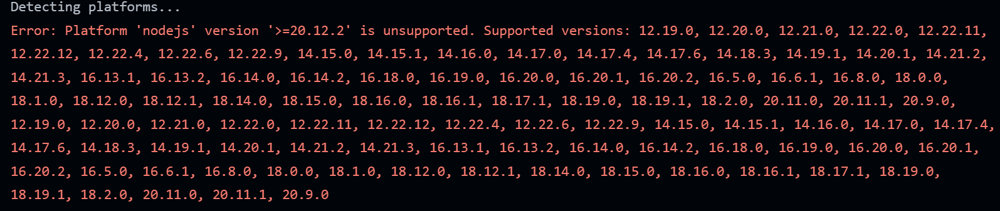

1. Use VScode to publish the project to GitHub
    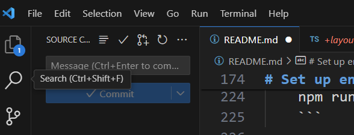

1. View the GitHub project
    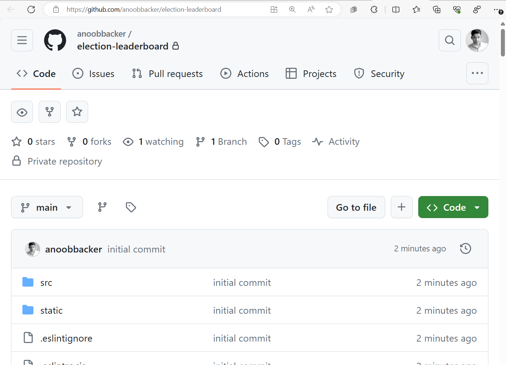

1. Create a Azure Stack Web App. Click [here](https://portal.azure.com/#create/Microsoft.StaticApp)
    - Web App Name: kotas-election
    - Plan type: Free (For hobby or personal projects)
    - Source: GitHub
    - Account: `youraccountname`
    - Organization: `yourorg`
    - Repository: `election-leaderboard`
    - Branch: `main`
    - Build Presets: `SvelteKit`
    - App location: `./`
    - Api location: `build/server`
    - Ouput location: `builder/static`

    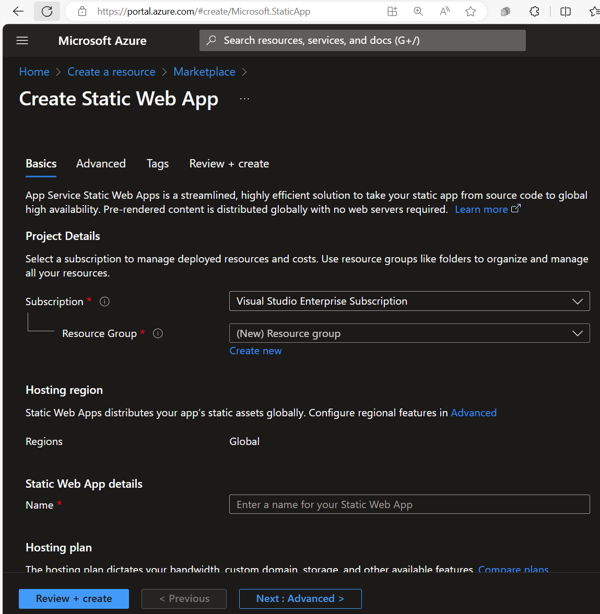

1. Go to the web app & copy the `URL` from _Essentials_

1. Go to `Static Web App` > `Environment variables`
    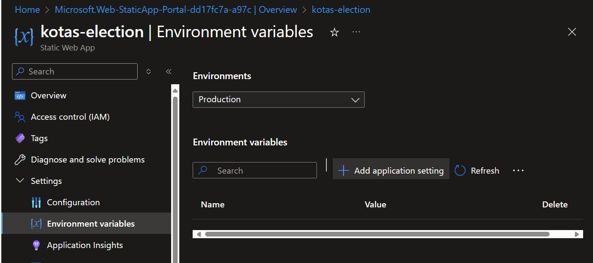

1. Add env variable application setting `PUBLIC_SUPABASE_URL`
    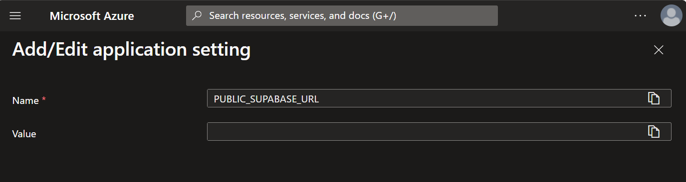

1. Repeat the same for env variable `PUBLIC_SUPABASE_ANON_KEY`

1. Repeat the same for env variable `VITE_PUBLIC_URL` and past the Static Web App URL.

1. To edit the Supabase allow list of URL, go to [URL Configuration](https://supabase.com/dashboard/project/_/auth/url-configuration) and add public URL for the Static Web App.
    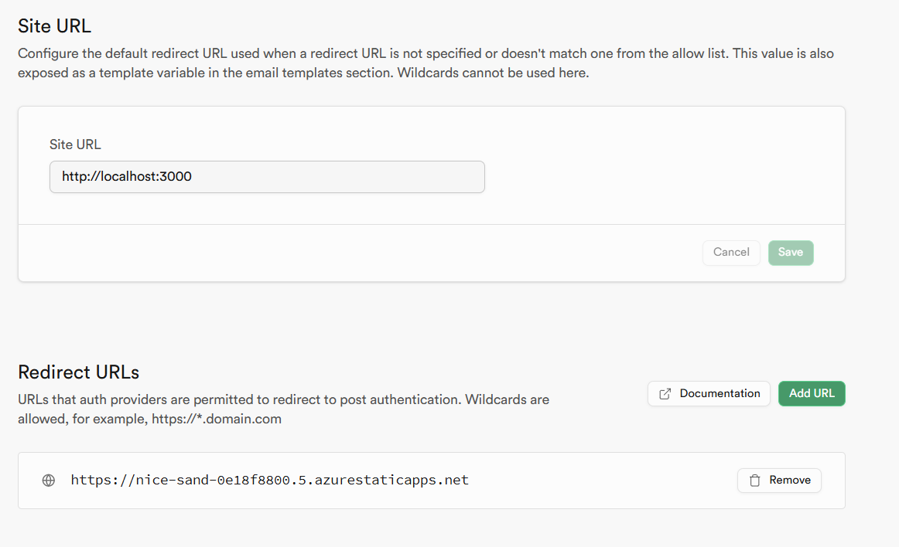

1. Check Your Current Node.js Version: Run `node -v` in your terminal to find out the version of Node.js that is currently installed.


1. Go to [project settings](https://github.com/anoobbacker/election-leaderboard/settings) and add `.env` variable for Actions
    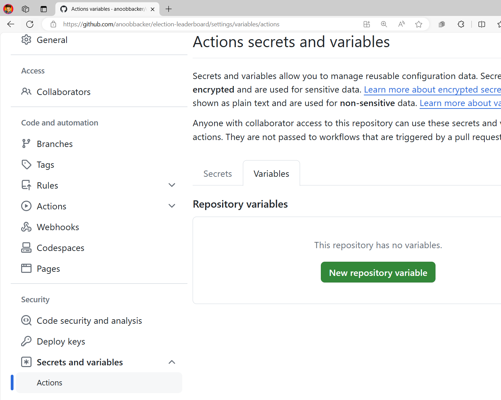

1. Add the variables to the workflow
    ```
        env:
          PUBLIC_SUPABASE_URL: ${{vars.PUBLIC_SUPABASE_URL }}
          PUBLIC_SUPABASE_ANON_KEY: ${{vars.PUBLIC_SUPABASE_ANON_KEY }}
    ```

1. After adding it should look like below:
    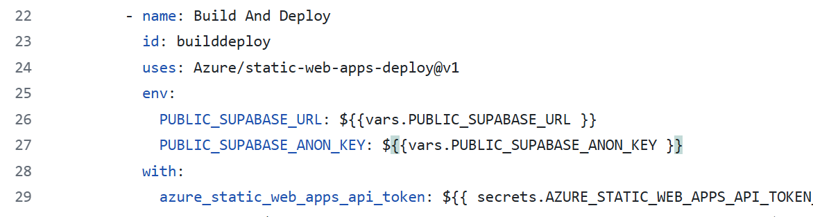

1. Re-run the workflow

1. Record the demo and convert to GIF for embedding into the README.md
    ```bash
    ffmpeg -i .\assets\kotas-election-leaderboard.mp4 -vf "fps=10,scale=1024:-1:flags=lanczos" -c:v gif .\assets\kotas-election-leaderboard.gif
    ```

# Tools used
- [SvelteKit](https://kit.svelte.dev/)
- [Supabase](https://supabase.com)
- [TailwindCSS](https://tailwindui.com/)
- [Typescript](https://www.typescriptlang.org/)
- [Vite](https://vitest.dev/)
- [Getavataaars](https://getavataaars.com)
- [FFmpeg](https://ffmpeg.org/)

# Copyright and License
Code released under the [MIT](./LICENSE) license.
