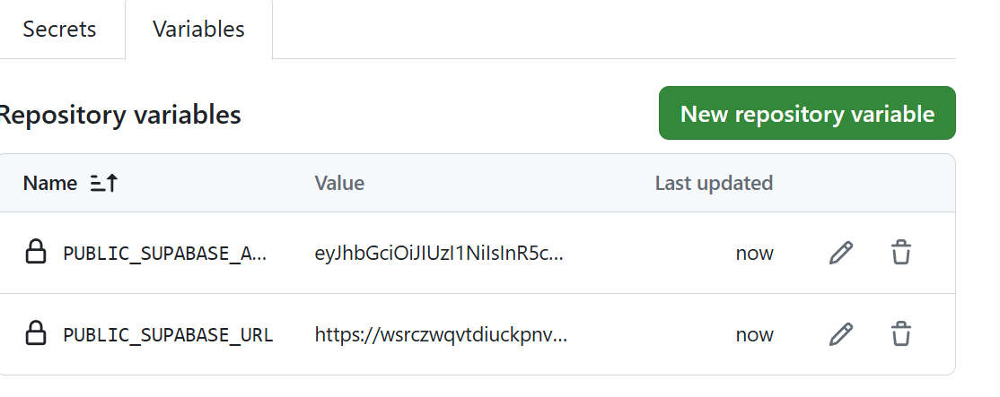

# Election prediction leaderboard

## TODO
Try to make this a viral site such that entire Kerala people can participate. The same can be used for other Kerala elections. In future, expand this to all India.
### Pending changes
1. Show the candidates across all consitituency in a simple list of candidates with photos. Max 3 candidates per constituency. Refer https://tailwindui.com/components/application-ui/lists/grid-lists
1. Create a table to map candidate to party. The party symbol can be shown along with candiate using this table.
1. Create a table for group to participant mapping. Allow only one group for now and one participant in one group. Later will expand. Provide ways to add groups in future.
1. Create a table to capture each participant's prediction for each constituency a) candidate b) vote share c) number of votes
1. To submit predictions use tables and once selects show the photos of the candidates. Refer https://tailwindui.com/components/application-ui/lists/tables
1. To select the candidates use menu drop-down with photos. Refer https://tailwindui.com/components/application-ui/forms/select-menus
1. To input vote share and number of votes use input groups. Refer https://tailwindui.com/components/application-ui/forms/input-groups
1. Show the particpant's selection in a simple list of candidates with photos. 3 candidates per constituency. Refer https://tailwindui.com/components/application-ui/lists/grid-lists
1. Show previous election results from that constituency, exit polls etc.
1. Create a table to capture the final results.
1. Create a way to calculate the score for each participant and display the leaderboard.

### Good to have
1. Use TailwindCSS login control instead of the Svelte-kit default. Refer https://tailwindui.com/components/application-ui/forms/sign-in-forms
1. Can I do something such that AI model can be used to predict a result?

## Set up Supabase
1. Go to https://supabase.com/dashboard/projects
1. Create _New project_
1. Provide the details
    
1. Go to the [SQL Editor page](https://supabase.com/dashboard/project/_/sql) in the Dashboard.
1. Click User Management Starter.
1. Click Run.
    
1. Go to the [API Settings page](https://supabase.com/dashboard/project/_/settings/api) in the Dashboard.
1. Find your Project _URL_, _anon_, and _service_role_ keys on this page.
1. Save the environment variables in a .env placed in the root directory of your SvelteKit project. 
    All we need are the _SUPABASE_URL_ and the _SUPABASE_KEY_ key that you copied earlier.
    ```
    PUBLIC_SUPABASE_URL="YOUR_SUPABASE_URL"
    PUBLIC_SUPABASE_ANON_KEY="YOUR_SUPABASE_KEY"
    ```
1. Go to SQL Editor page, create a new query and run to create election candidate list:
    ```
    CREATE TABLE kerala_election_2024 (
        id SERIAL PRIMARY KEY,
        constituency VARCHAR(255),
        udf_candidate VARCHAR(255),
        ldf_candidate VARCHAR(255),
        nda_candidate VARCHAR(255),
        other1 VARCHAR(255)
    );

    INSERT INTO kerala_election_2024 (constituency, udf_candidate, ldf_candidate, nda_candidate) VALUES
    ('Kasaragod', 'Rajmohan Unnithan', 'MV Balakrishnan', 'ML Ashwini'),
    ('Kannur', 'K. Sudhakaran', 'MV Jayarajan', 'C Raghunath'),
    ('Vatakara', 'Shafi Parambil', 'K. K. Shailaja', 'Prafulla Krishna'),
    ('Wayanad', 'Rahul Gandhi', 'Annie Raja', 'K Surendran'),
    ('Kozhikode', 'MK Raghavan', 'Elamaram Kareem', 'MT Ramesh'),
    ('Malappuram', 'ET Mohammed Basheer', 'V Vaseef', 'M Abdul Salam'),
    ('Ponnani', 'Abdussamad Samadani', 'K.S. Hamza', 'Niveditha Subramanian'),
    ('Palakkad', 'VK Sreekandan', 'A Vijayaraghavan', 'C KrishnaKumar'),
    ('Alathur (SC)', 'Ramya Haridas', 'K. Radhakrishnan', 'TN Sarasu'),
    ('Thrissur', 'K Muraleedharan', 'VS Sunil Kumar', 'Suresh Gopi'),
    ('Chalakudy', 'Benny Behanan', 'C Raveendranath', 'KA Unnikrishnan'),
    ('Ernakulam', 'Hibi Eden', 'KJ Shine', 'KS Radhakrishnan'),
    ('Idukki', 'Dean Kuriakose', 'Joice George', 'Sangeetha Vishwanathan'),
    ('Kottayam', 'Francis George', 'Thomas Chazhikadan', 'Thushar Vellapally'),
    ('Alappuzha', 'KC Venugopal', 'AM Ariff', 'Sobha Surendran'),
    ('Mavelikara (SC)', 'Kodikunnil Suresh', 'CA Arun Kumar', 'Baiju Kalasala'),
    ('Pathanamthitta', 'Anto Antony', 'Thomas Isaac', 'Anil Antony'),
    ('Kollam', 'NK Premachandran', 'Mukesh Madhavan', 'G Krishnakumar'),
    ('Attingal', 'Adoor Prakash', 'V Joy', 'V Muraleedharan'),
    ('Thiruvananthapuram', 'Shashi Tharoor', 'Pannyan Raveendran', 'Rajeev Chandrasekhar');
    ```

1. 

    ```
    CREATE TABLE candidate_party_mapping (
        id SERIAL PRIMARY KEY,
        constituency_number INTEGER,
        constituency_name VARCHAR(255),
        candidate_name VARCHAR(255),
        party VARCHAR(255)
    );

    INSERT INTO candidate_party_mapping (constituency_number, constituency_name, candidate_name, party) VALUES
    (1, 'Kasaragod', 'Rajmohan Unnithan', 'INC'),
    (1, 'Kasaragod', 'MV Balakrishnan', 'CPI(M)'),
    (1, 'Kasaragod', 'ML Ashwini', 'BJP'),
    (2, 'Kannur', 'K. Sudhakaran', 'INC'),
    (2, 'Kannur', 'MV Jayarajan', 'CPI(M)'),
    (2, 'Kannur', 'C Raghunath', 'BJP'),
    (3, 'Vatakara', 'Shafi Parambil', 'INC'),
    (3, 'Vatakara', 'K. K. Shailaja', 'CPI(M)'),
    (3, 'Vatakara', 'Prafulla Krishna', 'BJP'),
    (4, 'Wayanad', 'Rahul Gandhi', 'INC'),
    (4, 'Wayanad', 'Annie Raja', 'CPI'),
    (4, 'Wayanad', 'K Surendran', 'BJP'),
    (5, 'Kozhikode', 'MK Raghavan', 'INC'),
    (5, 'Kozhikode', 'Elamaram Kareem', 'CPI(M)'),
    (5, 'Kozhikode', 'MT Ramesh', 'BJP'),
    (6, 'Malappuram', 'ET Mohammed Basheer', 'IUML'),
    (6, 'Malappuram', 'V Vaseef', 'CPI(M)'),
    (6, 'Malappuram', 'M Abdul Salam', 'BJP'),
    (7, 'Ponnani', 'Abdussamad Samadani', 'IUML'),
    (7, 'Ponnani', 'K.S. Hamza', 'CPI(M)'),
    (7, 'Ponnani', 'Niveditha Subramanian', 'BJP'),
    (8, 'Palakkad', 'VK Sreekandan', 'INC'),
    (8, 'Palakkad', 'A Vijayaraghavan', 'CPI(M)'),
    (8, 'Palakkad', 'C KrishnaKumar', 'BJP'),
    (9, 'Alathur (SC)', 'Ramya Haridas', 'INC'),
    (9, 'Alathur (SC)', 'K. Radhakrishnan', 'CPI(M)'),
    (9, 'Alathur (SC)', 'TN Sarasu', 'BJP'),
    (10, 'Thrissur', 'K Muraleedharan', 'INC'),
    (10, 'Thrissur', 'VS Sunil Kumar', 'CPI(M)'),
    (10, 'Thrissur', 'Suresh Gopi', 'BJP'),
    (11, 'Chalakudy', 'Benny Behanan', 'INC'),
    (11, 'Chalakudy', 'C Raveendranath', 'BDJS'),
    (11, 'Chalakudy', 'KA Unnikrishnan', 'BJP'),
    (12, 'Ernakulam', 'Hibi Eden', 'INC'),
    (12, 'Ernakulam', 'KJ Shine', 'CPI(M)'),
    (12, 'Ernakulam', 'KS Radhakrishnan', 'BJP'),
    (13, 'Idukki', 'Dean Kuriakose', 'INC'),
    (13, 'Idukki', 'Joice George', 'BDJS'),
    (13, 'Idukki', 'Sangeetha Vishwanathan', 'BJP'),
    (14, 'Kottayam', 'Francis George', 'KEC'),
    (14, 'Kottayam', 'Thomas Chazhikadan', 'CPI(M)'),
    (14, 'Kottayam', 'Thushar Vellapally', 'BDJS'),
    (15, 'Alappuzha', 'KC Venugopal', 'INC'),
    (15, 'Alappuzha', 'AM Ariff', 'CPI(M)'),
    (15, 'Alappuzha', 'Sobha Surendran', 'BJP'),
    (16, 'Mavelikara (SC)', 'Kodikunnil Suresh', 'INC'),
    (16, 'Mavelikara (SC)', 'CA Arun Kumar', 'CPI(M)'),
    (16, 'Mavelikara (SC)', 'Baiju Kalasala', 'BJP'),
    (17, 'Pathanamthitta', 'Anto Antony', 'INC'),
    (17, 'Pathanamthitta', 'Thomas Isaac', 'CPI(M)'),
    (17, 'Pathanamthitta', 'Anil Antony', 'BJP'),
    (18, 'Kollam', 'NK Premachandran', 'RSP'),
    (18, 'Kollam', 'Mukesh Madhavan', 'CPI(M)'),
    (18, 'Kollam', 'G Krishnakumar', 'BJP'),
    (19, 'Attingal', 'Adoor Prakash', 'INC'),
    (19, 'Attingal', 'V Joy', 'CPI(M)'),
    (19, 'Attingal', 'V Muraleedharan', 'BJP'),
    (20, 'Thiruvananthapuram', 'Shashi Tharoor', 'INC'),
    (20, 'Thiruvananthapuram', 'Pannyan Raveendran', 'CPI'),
    (20, 'Thiruvananthapuram', 'Rajeev Chandrasekhar', 'BJP');
    ```

1. Go to SQL Editor page, create a new query and run to create election prediction for each participant:
    ```
    CREATE TABLE election_prediction_2024 (
        participant_id UUID NOT NULL,
        constituency TEXT NOT NULL,
        candidate_name TEXT,
        vote_share INT CHECK (vote_share >= 0 AND vote_share <= 100),  -- Ensure vote share is a percentage between 0 and 100
        winning_margin INT CHECK (winning_margin >= 0 AND winning_margin <= 2000000),  -- Cap the winning margin at 20 lakh
        updated_at TIMESTAMP WITH TIME ZONE DEFAULT CURRENT_TIMESTAMP,
        PRIMARY KEY (participant_id, constituency),
        FOREIGN KEY (participant_id) REFERENCES profiles (id) -- Assumes you have a 'users' table with 'id' as UUID.
    );
    ```
## Collect the details for election
1. Go to [2024 Kerala election - Wikipedia ](https://en.wikipedia.org/wiki/2024_Indian_general_election_in_Kerala) and get details


## Use ChatGPT to generate the boilerplate code
```
write a code using SvleteKit, TailwindCSS and TypeScript for a modern website for entering election predictions for Kerala Election 2024 and find the leader using below rules.
1. Admin can create a group with name and participant's email addresses
2. Particpants can login using one-time password sent to to their email.
3. After login participants can select the winner name for each consistency, enter vote share percentage, and number of votes by which the person will win.
4. After submission of the predictions, participant sees the leaderboard where for each consituency it shows the list of participants winner selection.
5. Find the constituency, UDF, LDF and NDA candidate details from attached image
```

# Set up env
1. Install the miniconda. Refer [Documentation](https://conda.io/projects/conda/en/stable/user-guide/install/index.html)

1. I am using Windows 11 and PowerShell. Go to the installation directory and run the below:
    ```PowerShell
    cd E:\miniconda3-py3.9\Library\bin

    .\conda.bat init powershell
    ```
1. Set up a environment for the aider creation
    ```
    conda create -n election-leaderboard
    ```
1. Activate the environment
    ```
    conda activate election-leaderboard
    ```

1. Download and install Node.js. 
    Follow the instructions from https://nodejs.org/en/download

1. Set up SvelteKit with TailwindCSS & Supabase
    Everything you need to build a Svelte project, powered by [`create-svelte`](https://github.com/sveltejs/kit/tree/main/packages/create-svelte).

    ```
    npm create svelte@latest election-predictions
    cd election-predictions
    npm install
    
    npx svelte-add@latest tailwindcss
    npm install

    npm install @supabase/ssr @supabase/supabase-js

    npm install -D @tailwindcss/forms
    ```

1. DONOT follow [here](https://supabase.com/docs/guides/auth/server-side/sveltekit). Rather follow: https://supabase.com/docs/guides/auth/server-side/sveltekit


1. Run app
    Once you've created a project and installed dependencies with `npm install` (or `pnpm install` or `yarn`), start a development server:

    ```bash
    npm run dev

    # or start the server and open the app in a new browser tab
    npm run dev -- --open
    ```

1. Deploy app
Follow the instruction at https://github.com/geoffrich/svelte-adapter-azure-swa
Run the below command
    ```
    npm install -D svelte-adapter-azure-swa
    ```

1. Update  your `svelete.config.js`
    ```javascript
    import azure from 'svelte-adapter-azure-swa';

    export default {
        kit: {
            ...
            adapter: azure()
        }
    };
    ```

1. Update  your  `src/app.d.ts`
    ```typescript
    /// <reference types="svelte-adapter-azure-swa" />
    ```
1. Update package.json to include the below. Here using the version supported by GitHub.
    ```
	"engines": {
        "node": ">=20.11.1"
    }
    ```
    

1. Refer [env-variables](https://kit.svelte.dev/docs/adapter-node#environment-variables) to understand how to set env variables in production. In production, .env files are not automatically loaded. To do so, install dotenv in your project...

    ```
    npm install dotenv
    ```

    ...and invoke it before running the built app:

    ```diff
    -node build
    +node -r dotenv/config build
    ```

1. Use VScode to publish the project to GitHub
    

1. View the GitHub project
    

1. Create a Azure Stack Web App. Click [here](https://portal.azure.com/#create/Microsoft.StaticApp)
    - Web App Name: kotas-election
    - Plan type: Free (For hobby or personal projects)
    - Source: GitHub
    - Account: `youraccountname`
    - Organization: `yourorg`
    - Repository: `election-leaderboard`
    - Branch: `main`
    - Build Presets: `SvelteKit`
    - App location: `./`
    - Api location: `build/server`
    - Ouput location: `builder/static`

    

1. Go to the web app & copy the `URL` from _Essentials_
    
    

1. Go to `Static Web App` > `Environment variables`
    

1. Add env variable application setting `PUBLIC_SUPABASE_URL`
    

1. Repeat the same for env variable `PUBLIC_SUPABASE_ANON_KEY`

1. Repeat the same for env variable `VITE_PUBLIC_URL` and past the Static Web App URL.

1. To edit the Supabase allow list of URL, go to [URL Configuration](https://supabase.com/dashboard/project/_/auth/url-configuration) and add public URL for the Static Web App.
    

1. Check Your Current Node.js Version: Run `node -v` in your terminal to find out the version of Node.js that is currently installed.


1. Go to [project settings](https://github.com/anoobbacker/election-leaderboard/settings) and add `.env` variable for Actions
    

1. Once added it will look like:
    

1. Add the variables to the workflow
    ```
        env:
          PUBLIC_SUPABASE_URL: ${{vars.PUBLIC_SUPABASE_URL }}
          PUBLIC_SUPABASE_ANON_KEY: ${{vars.PUBLIC_SUPABASE_ANON_KEY }}
    ```

1. After adding it should look like below:
    

1. Re-run the workflow

1. To view the Static Web App logs, open Azure Cloud Shell and run the below command:

# Tech used
This uses Svelte, Supabase, Bootstrap, HTML, JS, CSS for a static single pages design best suited for all devices like mobile, desktop etc.

- [SvelteKit](https://kit.svelte.dev/)
- [Supabase](https://supabase.com)
- [TailwindCSS](hhttps://tailwindui.com/)
- [Typescript](https://www.typescriptlang.org/)
- [Vite](https://vitest.dev/)
- Avatars generated from [Getavataaars](https://getavataaars.com).

# Copyright and License
Code released under the [MIT](https://github.com/anoobbacker/betwc/blob/master/LICENSE) license.
